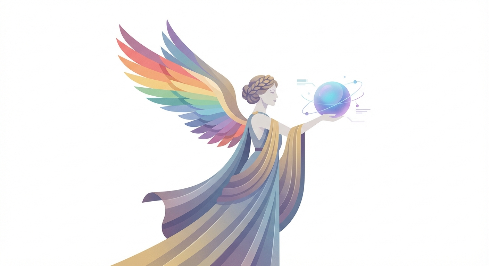

# 🌈 Iris — Sua Assistente Pessoal de IA

<p align="center">
    <picture>
        
    </picture>
</p>

<p align="center">
  <strong>A ponte entre você e a inteligência artificial</strong>
</p>

<p align="center">
  <a href="https://github.com/qualiobra/iris/actions/workflows/ci.yml?branch=main"></a>
  <a href="https://github.com/qualiobra/iris/releases"></a>
  <a href="LICENSE"></a>
</p>

**Iris** é uma *assistente pessoal de IA* que roda nos seus próprios dispositivos.
Ela responde nos canais que você já usa (WhatsApp, Telegram, Slack, Discord, Google Chat, Signal, iMessage, Microsoft Teams, WebChat), além de canais de extensão como BlueBubbles, Matrix e Zalo. Pode falar e ouvir no macOS/iOS/Android, e renderizar um Canvas ao vivo que você controla. O Gateway é apenas o plano de controle — o produto é a assistente.

Se você quer uma assistente pessoal que seja local, rápida e sempre disponível, é isso aqui.

---

## 🌟 Por que "Iris"?

Na mitologia grega, **Iris** era a deusa mensageira — a ponte entre os deuses e a humanidade. Ela viajava pelo arco-íris, conectando mundos diferentes.

É exatamente isso que esta assistente faz: **conecta você à inteligência artificial** de forma natural, através dos canais que você já usa no dia a dia.

O nome também carrega uma história pessoal de fé e perseverança — um arco-íris que apareceu no céu em um momento difícil, lembrando que sempre há alguém olhando por nós.

---

## ✨ Destaques

- **Gateway local** — plano de controle único para sessões, canais, ferramentas e eventos
- **Inbox multi-canal** — WhatsApp, Telegram, Slack, Discord, Google Chat, Signal, iMessage, e mais
- **Roteamento multi-agente** — direcione canais/contas/peers para agentes isolados
- **Voice Wake + Talk Mode** — fala sempre ativa para macOS/iOS/Android com ElevenLabs
- **Canvas ao vivo** — workspace visual controlado pelo agente
- **Ferramentas nativas** — browser, canvas, nodes, cron, sessions, e ações Discord/Slack
- **Apps complementares** — app de menu bar macOS + nodes iOS/Android
- **Onboarding + skills** — setup guiado por wizard com skills bundled/managed/workspace

---

## 🚀 Instalação

Runtime: **Node ≥22**

```bash
npm install -g iris@latest
# ou: pnpm add -g iris@latest

iris onboard --install-daemon
```

O wizard instala o daemon do Gateway (serviço launchd/systemd) para que ele continue rodando.

---

## ⚡ Quick Start

```bash
iris onboard --install-daemon

iris gateway --port 18789 --verbose

# Enviar uma mensagem
iris message send --to +5511999999999 --message "Olá da Iris!"

# Conversar com a assistente
iris agent --message "Me ajuda a organizar meu dia" --thinking high
```

---

## 📚 Documentação

Este projeto é um fork do [OpenClaw](https://github.com/openclaw/openclaw), adaptado e traduzido para o público brasileiro.

- [Documentação OpenClaw](https://docs.openclaw.ai)
- [Getting Started](https://docs.openclaw.ai/start/getting-started)
- [Configuração](https://docs.openclaw.ai/gateway/configuration)

---

## 🛡️ Segurança

Por padrão, DMs de desconhecidos requerem pareamento:
- `dmPolicy="pairing"`: remetentes desconhecidos recebem um código de pareamento
- Aprove com: `iris pairing approve`
- DMs públicos requerem opt-in explícito

---

## 🤝 Contribuindo

Contribuições são bem-vindas! PRs com IA/vibe-coding também! 🤖

Este projeto é mantido pela [QualiApps](https://qualiapps.com.br) como parte da missão de democratizar o acesso à inteligência artificial no Brasil.

---

## 📜 Licença

MIT License — veja [LICENSE](LICENSE) para detalhes.

---

## 💜 Créditos

- Fork do [OpenClaw](https://github.com/openclaw/openclaw) por Peter Steinberger e comunidade
- Adaptação brasileira por [QualiApps](https://qualiapps.com.br)
- Nome e identidade visual: **Iris** 🌈

---

<p align="center">
  <em>"A ponte entre você e a inteligência artificial"</em>
</p>
